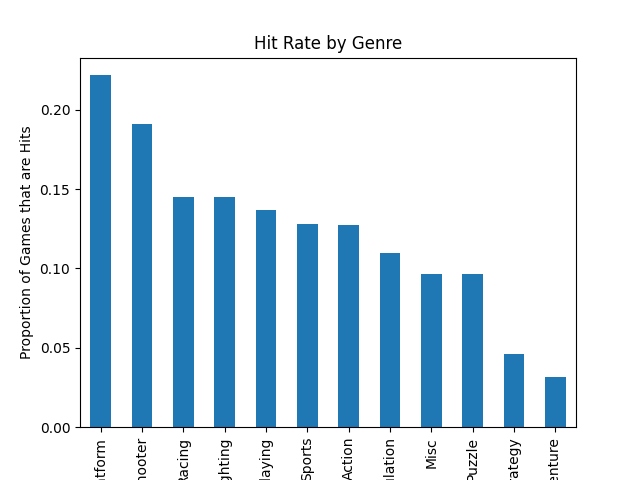

# Video Game Sales — Hit Prediction

## Question
Can a game's platform and genre predict whether it becomes a "hit" (sells over 1 million copies globally)?

## Data
Kaggle "Video Game Sales" dataset — ~16,500 games with platform, genre, publisher, and regional/global sales figures.

## Approach
- Cleaned the dataset by dropping rows with missing values
- Created a binary target: is_hit = 1 if Global_Sales > 1M copies, else 0
- Converted Platform and Genre into numeric features using one-hot encoding (pd.get_dummies)
- Trained a Decision Tree Classifier (max_depth=5) on an 80/20 train-test split

## Key Findings

- The model achieved 88.8% accuracy predicting hits from Platform and Genre alone
- However, 87.5% of games in the dataset are not hits — meaning a model that always guessed "not hit" would already score 87.5% without learning anything
- The model only outperforms this baseline by ~1.2 percentage points, showing that Platform and Genre alone are weak predictors of commercial success
- This suggests other factors — likely Publisher (major studios may dominate hits) or Year (market size changed over time) — carry more predictive signal

## What I'd try next
- Add Publisher (grouped into top studios + "Other") as a feature
- Try a Random Forest instead of a single Decision Tree
- Include Year to capture market growth over time
